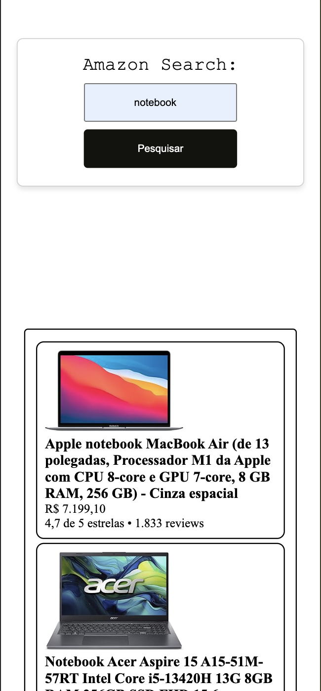
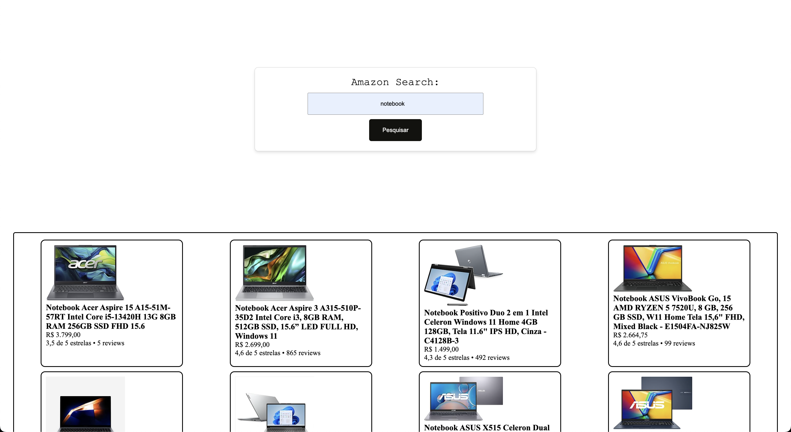

# Amazon Search
Fiz essa pequena página para testar minhas habilidades com API, onde criei a API e consumi na página. 
    O objetivo era pegar os resultados de uma busca na amazon e apresentar somente a primeira página.
    Nisso eu aprendi mais conceitos de como funciona a manipulação de DOM e novas ferramentas para desenvolvelvor na WEB.

# Índice

Sobre

Tecnologias

Como usar

Funcionalidades

Instalação

Contribuindo

Contato

# Sobre

É uma singlepage simples e minimalista que apenas retorna informações sobre produtos de uma busca.

Era um desafio de uma vaga junior e resolvi tentar fazer como forma de aprendizado.

# Tecnologias:

HTML/CSS Vanilla

Linguagens : JavaScript 

Runtime: Utilizei o bun para executar e testar o meu projeto.

Bibliotecas : express, axios, puppeeter e cors

Express para subir a API local, o axios para consumir dessa API e puppeeteer para ler o html da Amazon(sem tomar a negação de robo). o cors foi utilizado para acessar a API, pois o navegador bloqueava a requisição por serem de dominios diferentes.

# Como usar

Primeiro passo
    Clone o repositório e no terminal execute um 'bun install' para baixar as dependencias

# Pré-requisitos
    Tenha o bun instalado para rodar os arquivos.

#Como iniciar o projeto

# Clone o repositório
git clone https://github.com/GabrielSchafer/amazon_search.git

# Entre na pasta
cd amazon_search

# Instale as dependências
bun install

# Rode a API
bun run backend/api/api.js

# Rode a page
bun run frontend/index.html

# Abre o navegador e entre no localhost:3000

# Contribuindo
Se quiser contribuir montando um comparador de preços ou melhorar a estetica. Fork o projeto, crie uma branch e faça um Pull Request

Pull requests são bem-vindos!

Contato
Email: assmann002200@Outlook.com e LinkedIn: https://www.linkedin.com/in/gabriel-schafer-31ab48271/

## Print do sistema:

